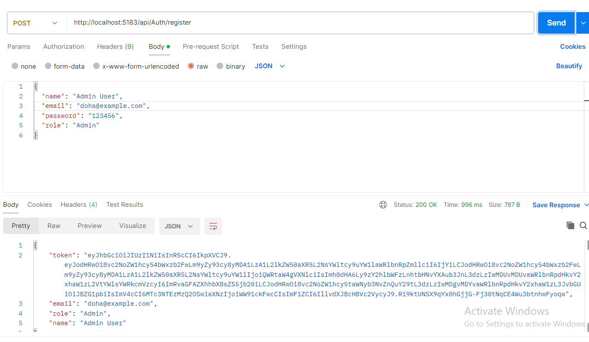
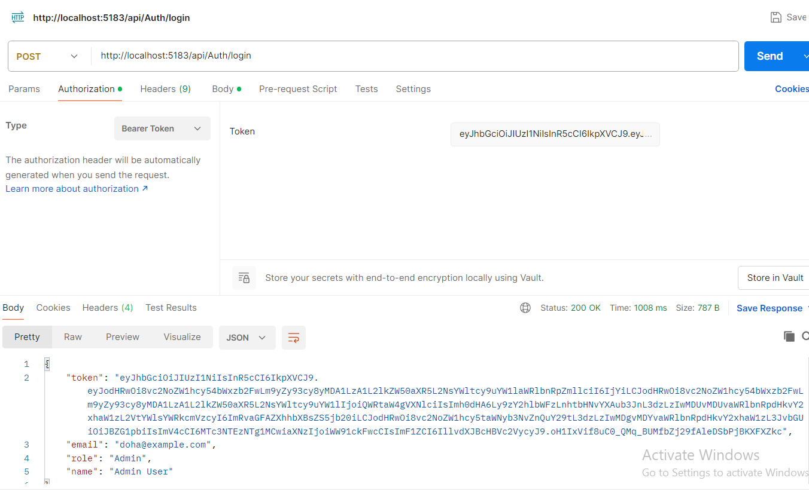
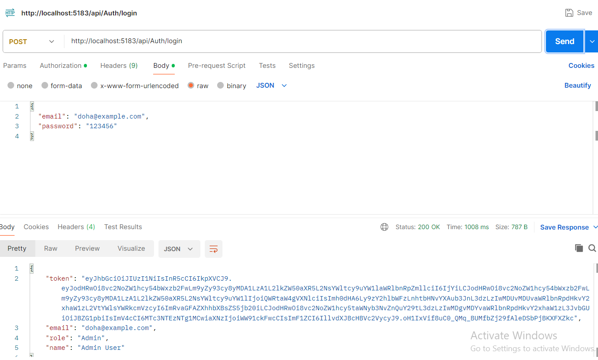
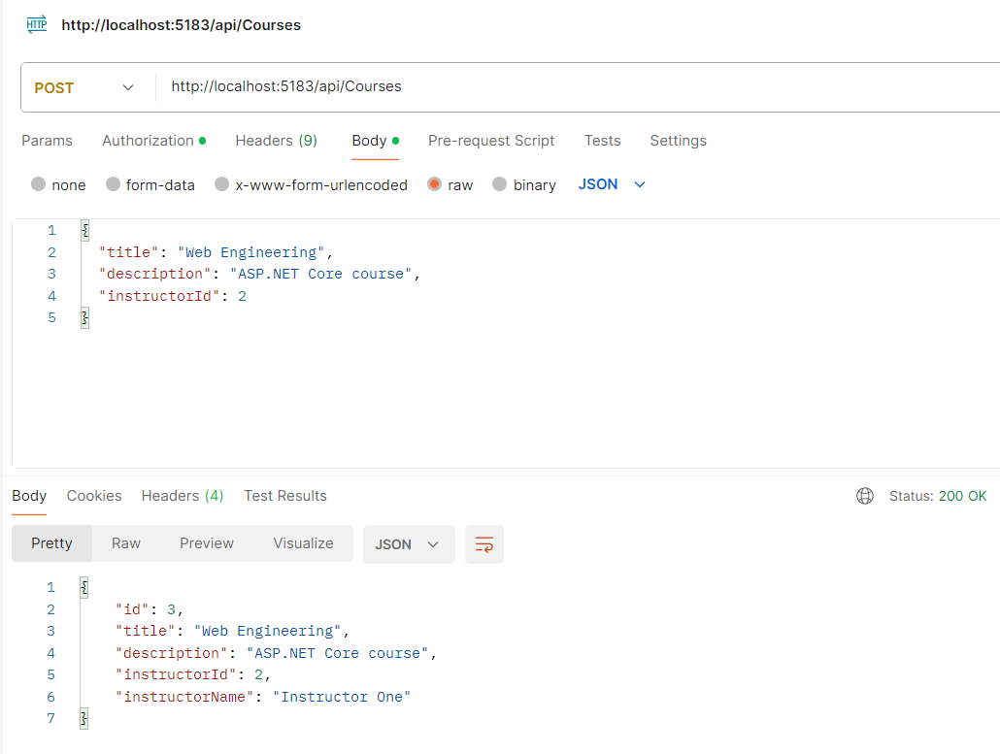
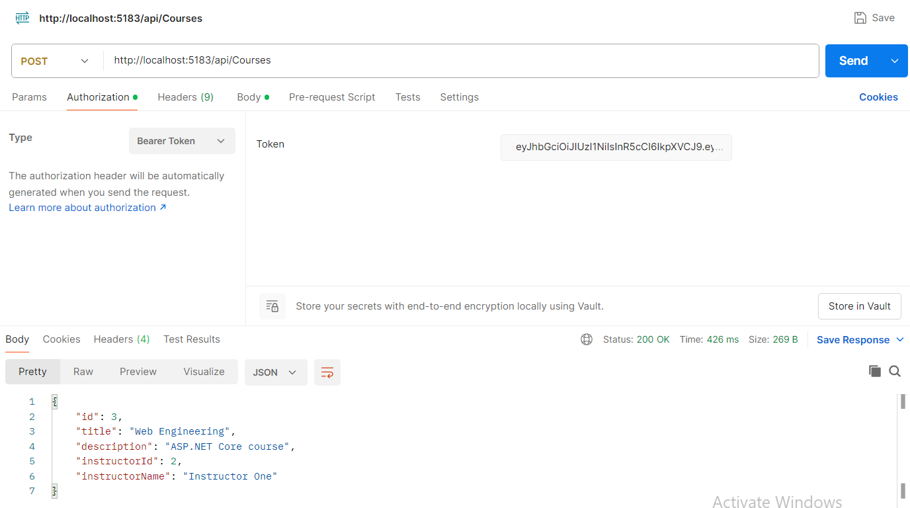
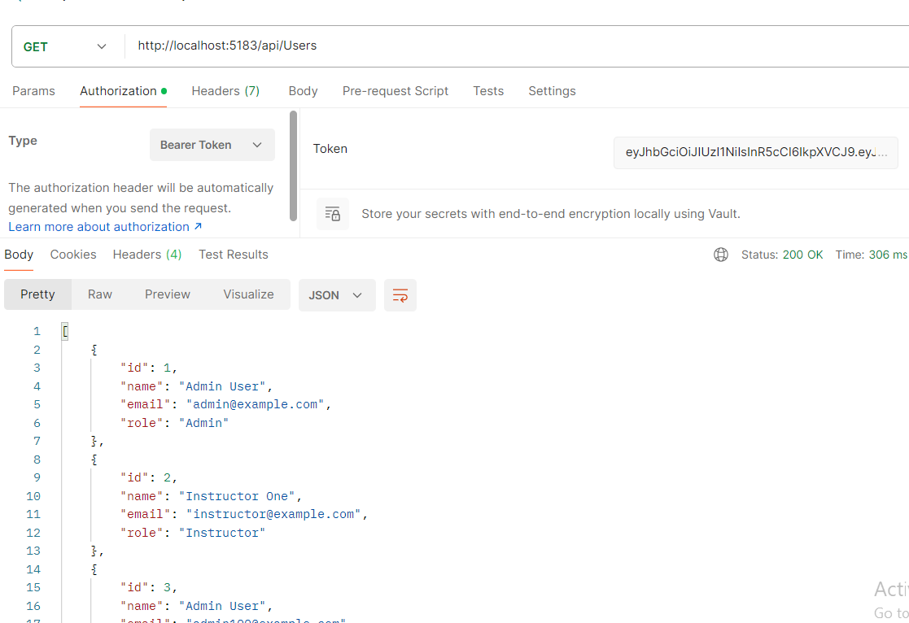
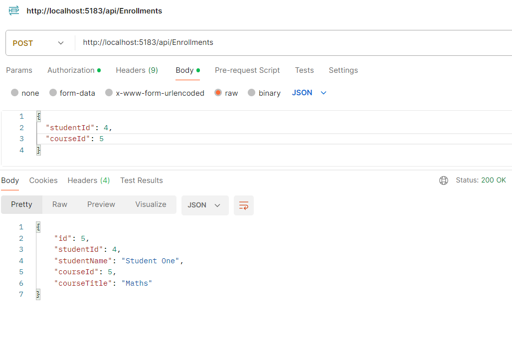

#  Course Management System API

##  Project Overview

This project is a **Course Management System API** developed using **ASP.NET Core Web API**.
It simulates a university system where:

* Instructors create and manage courses
* Students enroll in courses
* Admins manage users and system operations

The project demonstrates best practices in backend development including clean architecture, authentication, validation, and optimized data access.

---

##  Technologies Used

* **ASP.NET Core Web API** → Building RESTful APIs
* **Entity Framework Core** → ORM for database operations
* **PostgreSQL** → Relational database
* **JWT Authentication** → Secure user authentication
* **LINQ** → Efficient data querying and projection
* **Postman** → API testing and documentation

---

##  Project Structure

* **Models** → Database entities
* **DTOs** → Request & response objects
* **Services** → Business logic layer
* **Interfaces** → Abstraction for services
* **Controllers** → API endpoints
* **Data** → Database context
* **Auth** → JWT handling

---

##  Entity Relationships

* **One-to-One**
  User ↔ InstructorProfile

* **One-to-Many**
  Instructor → Courses

* **Many-to-Many**
  Students ↔ Courses (via Enrollment)

---

##  Assignment Requirements Coverage

* Entity Relationships ✔️
* Dependency Injection ✔️
* Service Layer ✔️
* DTOs (Create / Update / Read) ✔️
* DTO Validation ✔️
* JWT Authentication ✔️
* Role-based Authorization ✔️
* LINQ Optimization (Select) ✔️
* AsNoTracking ✔️
* EF Core Migrations ✔️

---

##  Authentication & Authorization

* JWT authentication is implemented
* Users login to receive a token
* Token must be included in requests:

```text id="authheader"
Authorization: Bearer YOUR_TOKEN
```

### Roles:

* **Admin**
* **Instructor**
* **Student**

### Example:

* Only Admin can access Users endpoints
* Only Instructor/Admin can create courses
* Only Student/Admin can enroll

---

##  Example API Requests

### 🔹 Register

POST `/api/Auth/register`

```json id="registerexample"
{
  "name": "Admin User",
  "email": "admin100@example.com",
  "password": "123456",
  "role": "Admin"
}
```

---

### 🔹 Login

POST `/api/Auth/login`

```json id="loginexample"
{
  "email": "admin100@example.com",
  "password": "123456"
}
```

---

### 🔹 Create Course

POST `/api/Courses`

```json id="courseexample"
{
  "title": "Web Engineering",
  "description": "ASP.NET Core course",
  "instructorId": 2
}
```

---

### 🔹 Enroll Student

POST `/api/Enrollments`

```json id="enrollexample"
{
  "studentId": 4,
  "courseId": 1
}
```

---

##  LINQ Optimization

* Data is projected using `Select()` into DTOs
* Avoid returning full entities
* Improves performance and reduces payload size

---

##  AsNoTracking Usage

* All read-only queries use:

```text id="asnotracking"
AsNoTracking()
```

* Improves performance by disabling tracking

---

##  Error Handling

* **400 Bad Request** → Validation errors
* **401 Unauthorized** → Missing or invalid token
* **403 Forbidden** → Role not allowed
* **404 Not Found** → Resource not found

---

##  Database Setup

1. Install PostgreSQL
2. Configure connection string in `appsettings.json`
3. Apply migrations:

```bash id="migrationcmd"
dotnet ef database update
```

---

##  How to Run the Project

```bash id="runsteps"
dotnet build
dotnet run
```

Then test using Postman.

---

##  System Flow

Client → Controller → Service → Database
Database → Service → DTO → Controller → Client

---

##  Why HTTP-Only Cookies Are Used in Industry

HTTP-only cookies are preferred in production because:

* Prevent JavaScript access → protects against XSS
* Automatically sent with requests
* More secure than localStorage

This project uses JWT in headers for simplicity, but cookies are industry standard.

---

##  Screenshots

(Attach Postman screenshots showing:)

* Register request

* Login response (with token)


* Protected endpoint access


* Role-based authorization

* Enrollment operation



##  Conclusion

This project demonstrates a complete backend system with:

* Clean architecture
* Secure authentication
* Role-based authorization
* Efficient data handling

It provides a strong foundation for building scalable real-world applications.
